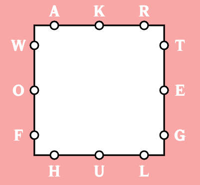

# NYTimesGames

  

This repository contains a set of two libraries that can be individually downloaded to help solve the Letter Boxed and Spelling Bee puzzles on the NY Times Games website (<a href="https://www.nytimes.com/crosswords" target="_blank">link</a>). 

 
 

<a href="https://captmd-11.github.io/blog/nytimesgames/" target="_blank">Download NYTimesGames JAR Files</a>

 
 

## Importing into Projects 
Instructions on how to install & import the libraries into a Java project are available <a target="_blank" href="https://captmd-11.github.io/blog/misc_instructions/howtoimportjavalibrary.html">here</a>. 

## How does the user input data? 
In order to access the methods in each class, you must first create an object of the class. 

Here are the constructors' headers for both the <samp>LetterBoxed</samp> and <samp>SpellingBee</samp> classes: 

<pre class="s-code-block language-java">
public LetterBoxed(String[][] inputLetterGrid)
public LetterBoxed(String urlPath, String[][] inputLetterGrid)

public SpellingBee(String inputMainLetter, String inputOtherLetters)
public SpellingBee(String urlPath, String inputMainLetter, String inputOtherLetters)
</pre>

### LetterBoxed
To instantiate a <samp>LetterBoxed</samp> object, a 2D <code>String</code> array (representing the Letter Boxed grid) must be inputted. For example, if a Letter Boxed grid looks like this: 

  

then the input 2D <code>String</code> array should be declared like so: 

<pre class="s-code-block language-java">
String[][] grid = { { "a", "k", "r" }, { "t", "e", "g" }, { "h", "u", "l" }, { "w", "o", "f" } };
</pre>

The ordering of the letters inside a particular subarray should not matter. 

If you choose to create an object with the first constructor, a default word list is automatically inputted for the program to utilize for its computations. If you would like to provide the program with a custom word list, create an object with the second constructor and provide the program with a URL (in <code>String</code> format) of an online word list. The custom word list file must have each word on a separate line. Here is an example: 

<pre class="s-code-block language-java">
String url = "https://raw.githubusercontent.com/dwyl/english-words/master/words.txt"; 
</pre>

### SpellingBee
To instantiate a <samp>SpellingBee</samp> object, a <code>String</code> containing the center letter and a <code>String</code> containing the surrounding letters must be inputted. For instance, if a Spelling Bee board looks like this: 

  

then the <code>String</code> inputs should be declared like so: 

<pre class="s-code-block language-java">
String centerLetter = "o"; 
String surroundingLetters = "lamdni"; 
</pre>

The ordering of the surrounding letters should not matter. 

If you choose to create an object with the first constructor, a default word list is automatically inputted for the program to utilize for its computations. If you would like to provide the program with a custom word list, create an object with the second constructor and provide the program with a URL (in <code>String</code> format) of an online word list. The custom word list file must have each word on a separate line. Here is an example: 

<pre class="s-code-block language-java">
String url = "https://raw.githubusercontent.com/dwyl/english-words/master/words.txt"; 
</pre>

## Documentation 
Java documentation for both NYTimesGames libraries are available in the download page. 

## <i>Letter Boxed</i> Version History
### v1.0
- INITIAL RELEASE

## <i>Spelling Bee</i> Version History
### v1.1
- returns words with minimum length of 4 letters 
### v1.0
- INITIAL RELEASE

## Important Notes
- Keep in mind that some of the words outputted by the methods in these libraries may not be inputted into the game, since the word list used by the NY Times is different than the ones accessed by these classes. 
- When creating inputs, please try to keep all letters in lower case. 

## License 
These libraries are protected by the <a target="_blank" rel="noopener noreferrer"
            href="https://github.com/CaptMD-11/NYTimesGames/blob/master/LICENSE.txt">GNU GPL</a> license.
